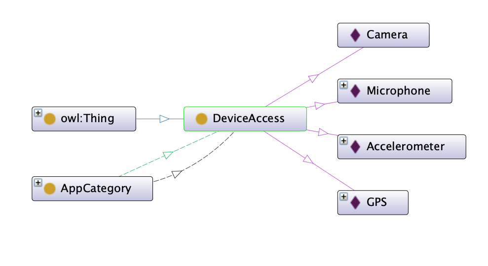

# <ins>Mobile Applications Ontology</ins>

Mobile applications are a very striking example of developing a complex ontology and capturing the links between their classifications. It is an extremely dynamic field, with many producers of such products, mostly well-known producers with an important role in the market, but also small teams of developers, and in some cases even a single developer.
This documentation presents the fundamentals of the ontology and its implementation, the presentation of classes, as well as the properties for objects and data in the ontology of mobile applications, query examples, but also screenshots in the Protéjé application for creating and modification of ontologies.

The model of the ontology presented was based on the following aspects:
* classification according to some criteria of mobile applications and the fundamental characteristics that differentiate them
* specifying the connections between classes
* mentioning the attributes for each instance captured in the ontology
* organizing into similar groups according to common criteria
* exemplification through concrete instances of real life (objects), with real names of applications

## Classes And Properties

### Classes

To create the ontology were used **55 classes**, designating the areas of interest that are most important to mobile application users representing their interests.

#### AppCategory

    

This class is the largest and with the most subclasses. It divides the organization of mobile applications into various categories, among which we list the following:

- Advertising
- Books - with the representative object which is the Scribd application
- Business - with the GoodTask application
- Education - using the MathematicalFormulas application like
example
- Enterprise
- Fun - with the 9gag example
- Finance - with the PayPal application
- Sports - with the ESPN model
- Tech
- TravelAndTransport
- Utilities - with SwiftkeyKeyboard
- Wearable
- Weather - with the Yahoo Weather application
- etc...

#### DeviceAccess

    

This class is intended to represent the structures of the telephone that the application can request access to, in the form of a request for rights to access it from the telephone of the user on which the application is installed.
As subclasses we mention:
- Accelerometer
- Camera
- GPS
- Microphone

#### Platform 

    

This class consists of the mobile platforms for which applications can be developed, such as Apple's iOS platform, Google's Android platform, and Microsoft's WindowsPhone.

#### Producer 

    

The Producer class models mobile application manufacturers, the independent entities responsible for creating, launching, and subsequent handling of bugs.

#### AppTypology

    

The AppTypology class refers to the three types that are important in the classification of mobile applications: Native, Web, Hybrid. Native applications are those applications developed only for mobile phones, web applications are those that can be accessed as a URL, and hybrid applications are applications with support on both sides.

#### Developer

    

The Developer class is a subclass of Person. We need to connect applications with their Developers because a Developer is responsible for creating, launching, and subsequent handling of bugs.

#### Nation

    

The Nation class is intended to connect Producers' headquarters and People's birthplaces and places.

### Properties

The properties in Protege to create ontologies are of two types:
- Object Properties
- Data Properties

The first type of property is built around the classes and refers to different actions reported between the classes and data properties  refer to information about individual objects.

    

#### Object Properties

- *bornIn*: Developer X born in Nation Y - Functional Property
- *developedFor*: AppCategory X is developed for Platform Y
- *hasAppTypology*: AppCategory X has app typology AppTypology Y
- *hasBranchIn*: Producer X has branch in Nation Y
- *hasDeviceCompatibility*: AppCategory X has device compatibility with Device Y
- etc...

#### Data Properties

- *appID*: ID of a Mobile Application (xsd:integer)
- *appSize*: Size of the Application (xsd:byte)
- *hasInAppPurchase*: If Application has in app purchases (xsd:boolean)
- *hasTabletCompatibility*: If Application can be used also with a Tablet (xsd:boolean)
- *isCrossPlatform*:  If a Programming Language is cross platform (xsd:boolean)
- *releaseDate*:
    - *firstVersionReleaseDate*
    - *currVersionReleaseData*
    
    They are (xsd:dateTime) that refer to the publication dates of an application in the store
    
- *userRanking*: A float number between 0.0 and 5.0 that refers to Application ranking on the app store (xsd:float)
- etc...

### Entity-Relationship Diagram

    

## Software

* [Protégé](https://protege.stanford.edu/products.php#desktop-protege)
* [WebVOWL](http://vowl.visualdataweb.org/webvowl.html)

## Queries

* [DL Queries](Queries/DL.md)
* [SPARQL Queries](Queries/SPARQL.md)